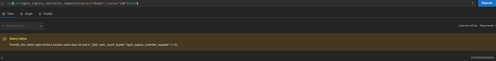
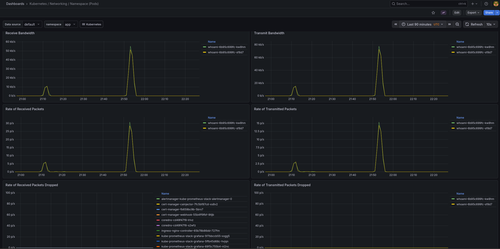
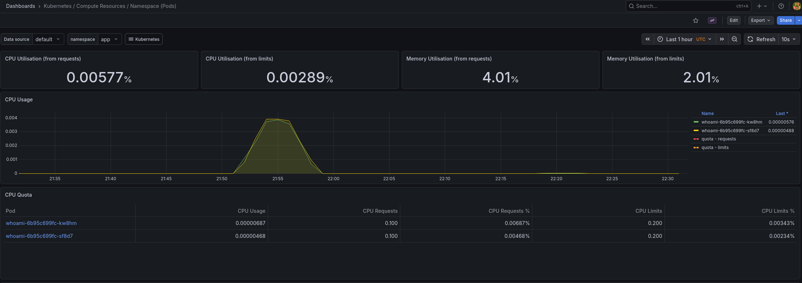
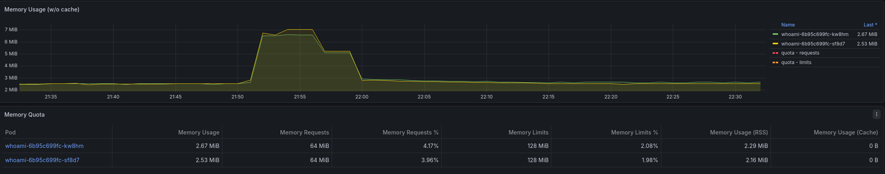

# SRE Challenge — High Availability Web Service on Kubernetes (EKS)

## Overview
This project implements a highly available web service on Kubernetes using AWS EKS, focusing on infrastructure automation, observability, and resilience.

## Objectives
- Provision infrastructure using Terraform
- Deploy a web application on Kubernetes
- Expose the application securely via HTTPS
- Implement monitoring and observability
- Perform stress testing and analyze system behavior

## Architecture (High-Level)
(To be added)

## Tech Stack
- AWS (EKS, VPC, S3)
- Terraform
- Kubernetes
- NGINX Ingress
- cert-manager + Let's Encrypt
- Prometheus & Grafana
- k6 (stress testing)

## Current Status
- [x] Bootstrap (S3 backend)
- [x] Network
- [x] EKS
- [x] Platform
- [x] Observability
- [x] Stress test

## Incremental Terraform Validation

The Terraform project was validated incrementally by creating the root module first and then adding functional stubs for the `network` and `eks` modules.

This approach made it possible to validate the project structure early, ensuring that module inputs and references were aligned before implementing the actual AWS resources.

## Network Module

The `network` module provisions the foundational AWS networking resources required by the project.

Implemented resources include:

- a dedicated VPC
- two public subnets across two Availability Zones
- two private subnets across two Availability Zones
- an Internet Gateway
- a single NAT Gateway for outbound internet access from private subnets
- public and private route tables with the appropriate associations

The public subnets are intended for internet-facing components such as the ingress load balancer, while the private subnets are reserved for the EKS worker nodes. This separation improves the security posture of the environment while keeping the architecture aligned with common AWS networking practices.

## EKS Module

The `eks` module provisions the Kubernetes control plane and worker nodes for the project.

Implemented resources include:

- an Amazon EKS cluster
- a managed node group
- IAM roles for the control plane and worker nodes
- IAM policy attachments required for EKS operation
- an OpenID Connect (OIDC) provider for future IAM Roles for Service Accounts (IRSA) integrations
- core EKS-managed add-ons:
  - VPC CNI
  - CoreDNS
  - kube-proxy

The cluster was configured to use private subnets for the worker nodes and both private and restricted public API access for cluster administration. This provides a balance between operational simplicity and improved security for the challenge environment.

## NGINX Ingress Controller

The NGINX Ingress Controller is deployed via Helm and configured through a dedicated values file.

### Current configuration

The deployment keeps the controller exposed through an external AWS load balancer:

    controller.service.type=LoadBalancer

To support observability, Prometheus metrics are enabled as well:

    controller.metrics.enabled=true
    controller.metrics.serviceMonitor.enabled=true

### Why this approach

Using a Helm values file instead of inline flags keeps the setup easier to maintain, document, and extend as the project evolves.

### Tooling

The following tools are required to interact with the Kubernetes cluster:

- kubectl
- Helm

Helm is used to install and manage Kubernetes packages such as the NGINX Ingress Controller and monitoring stack.

## Environment bootstrap

To make environment recreation more reproducible, the project includes a bootstrap script that orchestrates the deployment of the main Kubernetes add-ons and services in the correct order.

### What it does

The bootstrap script runs the following steps:

1. Deploy `ingress-nginx`
2. Wait for the LoadBalancer hostname
3. Deploy `cert-manager`
4. Deploy the sample application
5. Update the Route53 record for the application
6. Create or update the Grafana admin credentials secret
7. Install the observability stack
8. Update the Route53 record for Grafana

### Usage

Interactive mode:

    ./scripts/bootstrap-eks-addons.sh

Non-interactive mode for Grafana credentials:

    export GRAFANA_ADMIN_PASSWORD="your-password"
    ./scripts/bootstrap-eks-addons.sh

### Why this approach

This orchestration layer improves reproducibility, reduces manual errors during environment recreation, and makes the overall setup easier to demonstrate and document.

## Bootstrap orchestration

The bootstrap script supports resumable execution to make environment recreation easier.

### Examples

Run the full sequence:

    ./scripts/bootstrap-eks-addons.sh

Resume from a specific step:

    START_FROM=route53-app ./scripts/bootstrap-eks-addons.sh

Skip a step explicitly:

    SKIP_GRAFANA_SECRET=true ./scripts/bootstrap-eks-addons.sh

This reduces manual repetition and makes the setup more resilient when a single step fails.

## Load balancer behavior on EKS

The `ingress-nginx` controller is exposed through a Kubernetes `Service` of type `LoadBalancer`.

In this setup, because the AWS Load Balancer Controller is not installed, Amazon EKS falls back to the legacy AWS cloud provider behavior, which provisions a Classic Load Balancer by default.

A possible future improvement would be migrating to the AWS Load Balancer Controller to provision ALB or NLB resources using the recommended AWS-native approach.

## Automated Cluster Context Refresh

Because the lab environment may be destroyed and recreated for cost control, the ingress deployment script was designed to refresh the local kubeconfig automatically before interacting with the cluster.

This avoids failures caused by stale EKS API endpoints from previously destroyed environments and makes the deployment workflow more repeatable.

The script performs the following steps before installing the ingress controller:

- checks whether the EKS cluster exists and is in `ACTIVE` state
- updates the local kubeconfig with the current cluster endpoint
- validates Kubernetes API connectivity
- installs or upgrades the ingress controller with Helm

## Sample Application Deployment

A simple web application was deployed to the cluster to validate external traffic routing through the ingress layer.

The application was exposed through a Kubernetes `Service` and an `Ingress` resource managed by the NGINX Ingress Controller. Once deployed, it was successfully reached from outside the cluster through the AWS load balancer endpoint.

This step confirmed that the following components were working together correctly:

- the EKS cluster
- the NGINX Ingress Controller
- Kubernetes Services and Ingress resources
- external traffic routing into the cluster

## TLS Automation with cert-manager

TLS was automated using cert-manager and Let's Encrypt.

The application ingress was updated to include:

- a dedicated hostname (`whoami.andresantos.click`)
- a TLS section referencing a Kubernetes secret
- a cert-manager annotation pointing to the `letsencrypt-prod` ClusterIssuer

With DNS correctly delegated and the application hostname pointing to the ingress load balancer, cert-manager was able to complete the ACME HTTP-01 challenge and provision a valid TLS certificate automatically.

## ACME Validation Result

After DNS delegation was corrected and the application hostname resolved publicly, cert-manager successfully completed the ACME HTTP-01 validation flow and issued the TLS certificate for `whoami.andresantos.click`.

At that point, the most important success indicators were:

- the `Certificate` resource in `READY=True` state
- the creation of the `whoami-tls` secret
- successful HTTPS access to the application endpoint

`Order` and `Challenge` resources are mainly relevant during the issuance and troubleshooting phases, so their absence after successful issuance is not a problem.

## Automated DNS Updates

Because the lab environment is frequently destroyed and recreated, the load balancer hostname changes between runs.

To avoid manual DNS updates, a script was implemented using the AWS CLI to automatically update the Route 53 record with the current ingress load balancer.

This ensures that:

- the application hostname always points to the correct endpoint
- TLS validation with Let's Encrypt continues to work without manual intervention
- the environment can be recreated quickly and consistently

### Examples
```bash
./scripts/update-route53-record.sh whoami.andresantos.click
./scripts/update-route53-record.sh grafana.andresantos.click
```

This avoids duplicating DNS automation logic for each service exposed through Ingress.
  
## Observability

This project uses `kube-prometheus-stack` to provide cluster and workload observability on EKS.

### Components
- Prometheus
- Grafana
- Alertmanager
- kube-state-metrics
- node-exporter

### Grafana credentials

Grafana admin credentials are managed through a Kubernetes Secret.

The setup supports both interactive and non-interactive modes:

#### Interactive (recommended for local setup)

Run the script and provide the password when prompted:

    ./scripts/create-grafana-secret.sh

#### Non-interactive (CI/CD)

Set the password as an environment variable before running the script:

    export GRAFANA_ADMIN_PASSWORD="your-password"
    ./scripts/create-grafana-secret.sh

This approach avoids storing credentials in plaintext while keeping the setup simple and reproducible.

### Why this approach
The goal was to keep the observability stack reproducible and simple, while still following real SRE practices.  
Using `kube-prometheus-stack` reduced setup complexity and provided a solid baseline for:
- Kubernetes cluster health monitoring
- Pod and node resource usage
- Alerting capabilities
- Dashboard-based analysis during stress tests

### Access
Grafana is exposed through the existing NGINX Ingress and protected with TLS via cert-manager.

### Scope
At this stage, the focus is on:
- cluster metrics
- pod/container metrics
- ingress-level metrics
- support for stress test analysis

More advanced features such as centralized logs and distributed tracing were intentionally left out to avoid overengineering.

## Ingress metrics

To support traffic analysis during stress tests, the NGINX Ingress Controller exposes Prometheus metrics.

### What is monitored
- request rate
- request latency
- HTTP status codes
- ingress controller behavior under load

### Why this matters
Ingress metrics provide the most direct view of how external traffic affects the application and the Kubernetes entrypoint during load tests.

### Implementation
The ingress-nginx Helm deployment enables:
- Prometheus metrics
- ServiceMonitor integration for Prometheus Operator

This allows the observability stack to scrape ingress metrics automatically and visualize them in Grafana.

## Prometheus scraping for ingress-nginx

When using Prometheus Operator, the `ServiceMonitor` created by `ingress-nginx` must match the label selector configured in the Prometheus resource.

In this project, Prometheus selects `ServiceMonitor` resources with:

    release: kube-prometheus-stack

For that reason, the ingress-nginx Helm values add the same label to the generated `ServiceMonitor`.

Without this label, the metrics endpoint exists but Prometheus does not scrape it.

## Load testing and observability validation

After setting up Prometheus and Grafana, load tests were executed using k6 to validate the observability pipeline.

### Goals

- verify that ingress metrics are correctly collected
- analyze request throughput and latency
- validate system stability under load

### Results

- request rate increased as expected
- no HTTP 5xx errors observed
- ingress metrics successfully scraped by Prometheus
- latency metrics available for analysis

This confirms that the observability stack is working end-to-end.

## Grafana access through Ingress

Grafana is exposed through NGINX Ingress using the public hostname:

    https://grafana.andresantos.click

Because Grafana runs behind a reverse proxy with TLS termination at the ingress layer, the public server URL is explicitly configured.

### Why this matters

Without a correct `root_url`, Grafana may generate incorrect paths for static frontend assets, which can cause the UI to fail with the message:

    Grafana has failed to load its application files

### Configuration

The Grafana settings include:

    grafana.ini.server.domain = grafana.andresantos.click
    grafana.ini.server.root_url = https://grafana.andresantos.click/

## Load testing results and observability validation

A load test was executed using k6 to validate the observability stack and system behavior under load.

### Test characteristics

- target: whoami service
- ingress: nginx ingress controller
- peak load: ~30 requests per second
- duration: ~5 minutes

### Observations

#### Request throughput

Prometheus query:

    sum(rate(nginx_ingress_controller_requests{ingress="whoami",status="200"}[1m]))

- peak throughput reached ~30 req/s
- no HTTP 5xx errors observed

#### Network activity

Grafana dashboards showed:

- clear spike in network bandwidth during the test window
- increase in packet rates
- return to baseline after test completion

#### CPU usage

- CPU usage increased slightly but remained low
- expected behavior due to lightweight application

#### Memory usage

- memory increased from ~2.5MB to ~7MB during load
- returned to baseline after load

#### Stability

- no pod restarts
- no CPU throttling
- no error spikes

### Conclusion

The system successfully handled the applied load without degradation, and the observability stack correctly captured metrics across ingress, application, and infrastructure layers.

---

## Evidence

### Prometheus throughput



### Network activity spike



### Resource usage




### SRE perspective

From an SRE perspective, the system demonstrates:

- correct observability coverage (metrics from ingress, application, and cluster)
- stable behavior under moderate load
- absence of error amplification under traffic
- efficient resource usage (low CPU/memory footprint)

This indicates a well-configured and reliable baseline system.

## Architecture (High-Level)

The architecture is designed following standard AWS and Kubernetes best practices for high availability and security.

- A dedicated VPC with public and private subnets across two Availability Zones
- Public subnets host the ingress load balancer
- Private subnets host the EKS worker nodes
- A NAT Gateway enables outbound internet access for private workloads
- Route53 manages DNS records for application and observability endpoints

Traffic flow:

User → Route53 → AWS Load Balancer → NGINX Ingress → Kubernetes Service → Application Pods

TLS is terminated at the ingress layer using cert-manager with Let's Encrypt.

Observability is implemented through Prometheus and Grafana, collecting metrics from:
- Kubernetes components
- application workloads
- ingress controller

## Decisions

### Use of Classic Load Balancer (CLB)

The ingress-nginx controller was exposed using a Service of type LoadBalancer without the AWS Load Balancer Controller.

This results in AWS provisioning a Classic Load Balancer by default.

**Trade-off:**
- simpler setup
- faster implementation
- less control compared to ALB/NLB

**Alternative:**
- AWS Load Balancer Controller for ALB integration

---

### Use of kube-prometheus-stack

Instead of building observability from scratch, kube-prometheus-stack was used.

**Benefits:**
- faster setup
- production-grade defaults
- built-in dashboards and alerting

**Trade-off:**
- less customization initially

---

### Use of a lightweight test application (whoami)

A minimal application was chosen to focus on infrastructure and observability rather than application complexity.

**Trade-off:**
- low resource usage (does not stress CPU significantly)
- good for validating traffic flow and metrics

---

### Use of scripting instead of full CI/CD

Scripts were used to automate:
- ingress deployment
- cert-manager setup
- DNS updates
- observability stack

**Trade-off:**
- faster to implement
- easier to debug locally

**Future improvement:**
- GitHub Actions pipeline for full automation

---

## Production considerations

Although this project was designed for a reproducible lab environment, several improvements would be required for a production-ready setup.

### CI/CD pipelines

The current deployment relies on scripts for simplicity and speed. In production, this would be replaced by CI/CD pipelines:

- **Infrastructure pipeline (Terraform):**
  - automatic `plan` on pull requests
  - manual approval for `apply`
  - remote state locking and versioning

- **Application pipeline:**
  - build and push container images
  - automated deployment to Kubernetes
  - versioned releases

This approach improves traceability, consistency, and reduces manual errors.

---

### Environment separation

The current setup uses a single environment. A production architecture would include:

- separate environments (e.g. dev, staging, production)
- isolated Terraform states
- possibly separate clusters or namespaces per environment

This allows safer testing and controlled promotion of changes.

---

### Load balancing and ingress

The ingress is currently exposed using the default Kubernetes behavior, which provisions a Classic Load Balancer.

For production, I would use:

- AWS Load Balancer Controller
- Application Load Balancer (ALB)

This enables better integration with AWS, advanced routing, and improved scalability.

---

### Observability improvements

The project includes metrics with Prometheus and Grafana. A production setup would extend this with:

- centralized logging (e.g. Loki or ELK stack)
- distributed tracing (e.g. OpenTelemetry)
- alerting based on SLOs and SLIs

This provides full visibility across the system.

---

### Security considerations

Production improvements would include:

- fine-grained IAM roles (IRSA)
- secrets management using AWS Secrets Manager
- Kubernetes NetworkPolicies for traffic control

---

### Cost and availability trade-offs

To optimize cost in this lab environment, a single NAT Gateway was used.

In production, I would evaluate:

- multi-AZ NAT Gateway setup
- redundancy for critical components

Balancing cost and availability depending on business requirements.

---

### Cleanup and lifecycle management

During testing, it was observed that AWS Load Balancers created by Kubernetes can delay infrastructure teardown.

In a production workflow, I would:

- enforce cleanup automation
- ensure proper resource ownership
- implement safeguards in destroy pipelines

---

### Summary

This project demonstrates a functional and observable baseline.  
With the improvements described above, it can evolve into a production-ready platform with stronger guarantees around reliability, security, and operational excellence.